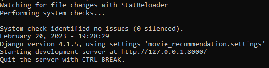

# Movie Recommendation System

A modern Django-based Movie Recommendation System with a beautiful UI, Vanta.js animated backgrounds, and smart autocomplete search.

---

## Features
- 🎬 **Movie search with instant suggestions**
- 🤖 **Personalized recommendations**
- ✨ **Animated backgrounds** (Birds/Fog) using Vanta.js
- 🎨 **Custom cursor and theme for a unique experience**
- 📱 **Mobile-friendly and responsive**

---

## Demo


<!-- Additional screenshots -->
<p align="center">
  
  
  
  
</p>

---

## Getting Started

### Prerequisites
- Python 3.8+
- pip

### Installation
1. **Clone the repository:**
   ```sh
   git clone https://github.com/Yadav050/movie-recommendation-system.git
   cd movie-recommendation-system
   ```
2. **Install dependencies:**
   ```sh
   pip install -r requirements.txt
   ```
3. **Apply migrations:**
   ```sh
   python manage.py migrate
   ```
4. **Run the server:**
   ```sh
   python manage.py runserver
   ```
5. **Open your browser:**
   Visit [http://127.0.0.1:8000/](http://127.0.0.1:8000/)

---

## Tech Stack
- **Backend:** Django
- **Frontend:** HTML, CSS, JavaScript
- **UI/UX:** Vanta.js, Bootstrap, Tabler Icons
- **Autocomplete:** jQuery UI

---

## Credits
- [Vanta.js](https://www.vantajs.com/) for animated backgrounds
- [Tabler Icons](https://tabler.io/icons) for icons
- [jQuery UI](https://jqueryui.com/autocomplete/) for autocomplete

---
